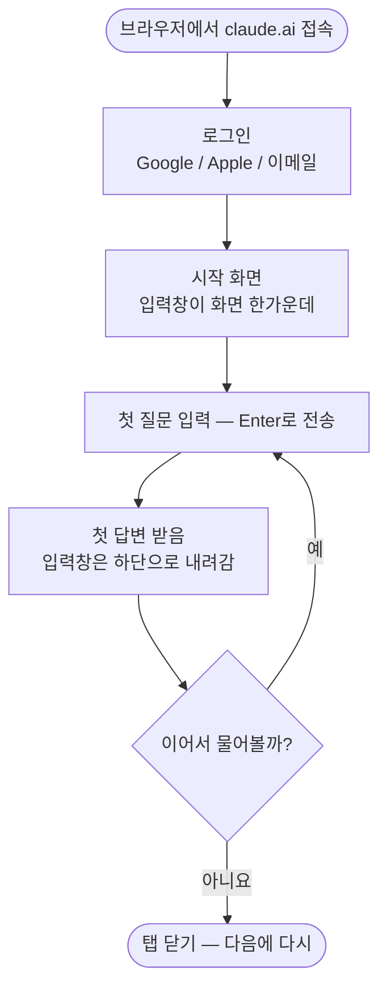
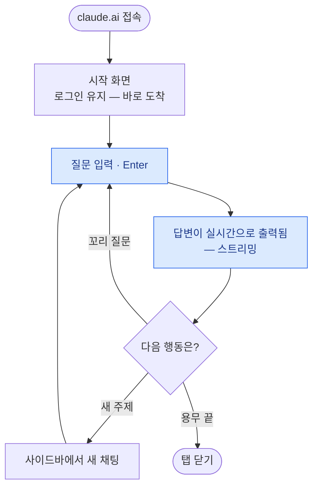
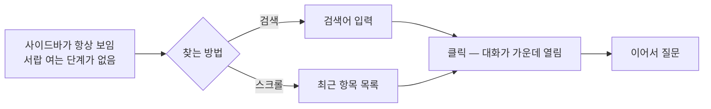
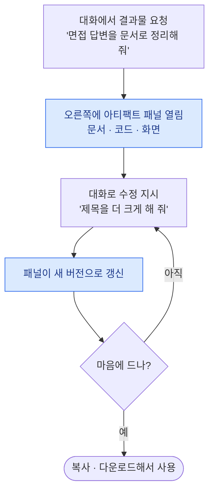
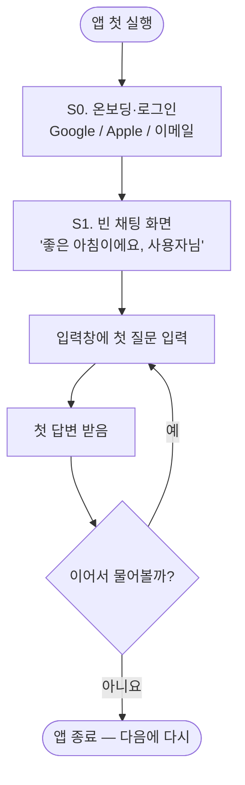
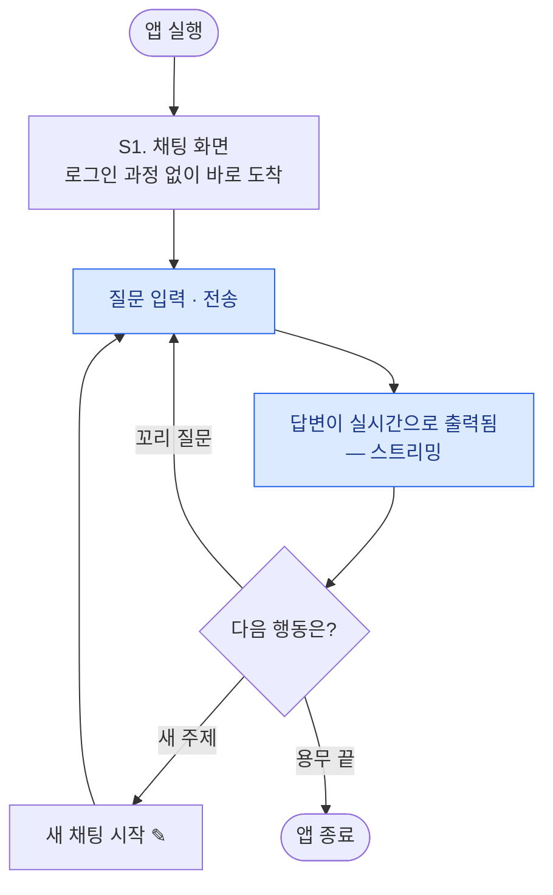
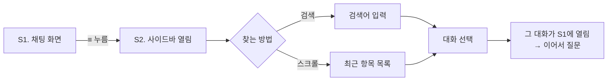

# Claude 분석 — IA · User Flow · Wireframe

> **분석 대상**: Claude 앱 (Anthropic) — 데스크톱(claude.ai) · 모바일 · 2026년 8월 기준
> 화면을 만들기 전에 정하는 세 가지를, 순서대로 Claude에 적용해 분석했습니다.

| 순서 | 이름 | 우리말 | 답하는 질문 |
|---|---|---|---|
| 1 | IA (Information Architecture) | 화면·메뉴 구조 | 화면이 몇 개이고 무엇이 어디에 있는가 |
| 2 | User Flow | 사용자 흐름 | 사용자가 어떤 순서로 움직이는가 |
| 3 | Wireframe | 화면 뼈대 | 각 화면에 무엇이 어디에 놓이는가 |

---

## 1. IA — 화면과 메뉴 구조

### 데스크톱 — 컴퓨터로 볼 때

데스크톱은 화면을 늘리는 대신 **한 화면을 영역으로 나눕니다.** 화면 하나에 영역이 셋입니다.

```
Claude (claude.ai) — 화면 하나, 영역 셋
├── 왼쪽 (사이드바 — 항상 보임)
│   ├── 새 채팅
│   ├── 검색
│   ├── 채팅 · 프로젝트
│   ├── 최근 항목 (최근 대화 목록)
│   └── 프로필 → 설정 페이지
├── 가운데 (대화 본문)
│   ├── 대화 제목 (상단)
│   ├── 주고받은 내용 (내 질문 오른쪽 · 답변 왼쪽)
│   └── 입력창 (+ 첨부 · 모델 선택 ⌄ · 전송)
└── 오른쪽 (아티팩트 패널 — 필요할 때만 열림)
    ├── 문서 · 코드 · 화면 미리보기
    └── 미리보기 ↔ 코드 · 복사 / 다운로드
```

### 모바일 — 폰으로 볼 때

모바일은 화면이 사실상 5개뿐이고, 중심은 **채팅 화면(S1) 하나**입니다.

```
Claude 앱
├── S0. 온보딩·로그인 (첫 실행에만 잠깐)
├── S1. 채팅 화면 ★ 기본 화면 — 앱의 중심
│   ├── 상단 바 (≡ 사이드바 · 대화 제목 · ✎ 새 채팅)
│   ├── 대화 영역 (내 질문 오른쪽 · Claude 답변 왼쪽 전체 폭)
│   └── 입력바 (+ 첨부 · 입력창 · 모델 선택 ⌄ · 음성 모드)
├── S2. 사이드바 — 서랍 (S1에서 ≡ 또는 스와이프)
│   ├── 검색
│   ├── 새 채팅
│   ├── 채팅 · 프로젝트
│   ├── 최근 항목 (최근 대화 목록)
│   └── 프로필 → S4. 설정 입구
├── S3. 음성 모드 (S1 입력바 오른쪽 버튼)
└── S4. 설정 (S2 프로필에서 진입)
    ├── 계정 · 구독 (Free / Pro / Max)
    ├── 개인 맞춤 (응답 스타일 · 메모리)
    └── 앱 환경 · 데이터 관리
```

뼈대는 둘이 같습니다. 폰은 화면이 좁아서 **왼쪽 영역(사이드바)이 서랍으로, 아티팩트 패널이 전체 화면으로 접힐 뿐**입니다.

---

## 2. User Flow — 사용자 흐름

### 데스크톱 — 컴퓨터로 볼 때

**Flow A. 처음 쓰는 사람 — 접속부터 첫 답변까지**



**Flow B. 매일의 핵심 루프 — 질문 ↔ 답변**



**Flow C. 지난 대화 이어가기 — 클릭 한 번**



**Flow D. 아티팩트 만들기 — 데스크톱만의 흐름**



### 모바일 — 폰으로 볼 때

**Flow A. 처음 쓰는 사람 — 설치부터 첫 답변까지**



**Flow B. 매일의 핵심 루프 — 질문 ↔ 답변**



**Flow C. 지난 대화 이어가기 — 서랍을 열고 찾기**



---

## 3. Wireframe — 화면 뼈대

그림 속 파란 번호(①②③…)와 설명이 짝을 이룹니다.

### 데스크톱 — 컴퓨터로 볼 때

<p align="center"></p>

<p align="center"></p>

<p align="center"></p>

### 모바일 — 폰으로 볼 때

<p align="center"></p>

<p align="center"></p>

<p align="center"></p>

<p align="center"></p>

---

화면·기능은 2026년 8월 Claude 앱(데스크톱·모바일) 기준이며, 업데이트에 따라 세부 모습은 조금씩 달라질 수 있습니다.
