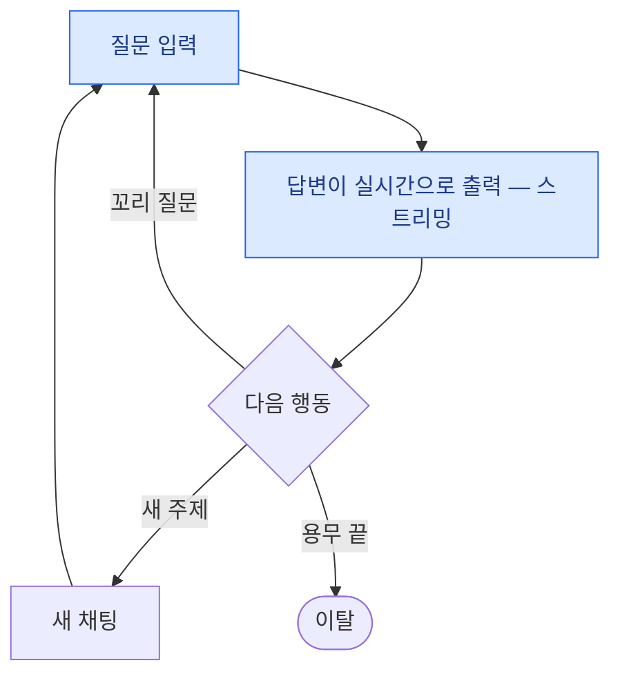

# 세 챗봇의 공통점 — Claude · ChatGPT · DeepSeek

> 서로 다른 세 회사가 따로 만들었는데, 화면 뼈대는 놀랄 만큼 같습니다.
> 셋에서 똑같이 반복되는 것 = **검증된 챗봇 UI의 표준** = 우리 챗봇이 그대로 따라도 되는 설계입니다.
> 아래에 1 IA → 2 User Flow → 3 Wireframe 순서로, 항목마다 공통점을 정리했습니다.

---

## 1. IA 공통점 — 화면·메뉴 구조

셋 다 이 뼈대 하나로 설명됩니다.

```
챗봇 공통 뼈대 — 셋 다 이 구조
├── 채팅 화면 1개가 중심 (시간의 90%를 보내는 곳)
│   ├── 대화 영역 (내 질문 오른쪽 · 답변 왼쪽 전체 폭)
│   └── 입력창 (항상 하단 · 부가 기능은 입력바 안에)
├── 사이드바 1개 — 데스크톱: 항상 보임 / 모바일: 서랍
│   ├── 새 채팅
│   ├── 대화 기록 (최신순 · 날짜 그룹)
│   └── 프로필 → 설정 입구
└── 설정 1개 (계정 · 앱 환경 · 데이터 — '목록 + ›' 패턴)
```

| 확인 항목 | Claude | ChatGPT | DeepSeek |
|---|---|---|---|
| 중심은 채팅 화면 1개 | ✅ | ✅ | ✅ |
| 사이드바 — 데스크톱은 상시, 모바일은 서랍 | ✅ | ✅ | ✅ |
| 새 채팅이 사이드바 맨 위 | ✅ | ✅ | ✅ (큰 버튼) |
| 대화 기록은 최신순 자동 정리 | ✅ 최근 항목 | ✅ 오늘/어제/7일 | ✅ 오늘/어제/7일 |
| 설정은 사이드바의 프로필에서 진입 | ✅ | ✅ | ✅ |
| 부가 기능은 화면을 늘리지 않고 배치 | 프로젝트 | GPTs·라이브러리·프로젝트 | (부가 기능 자체가 없음) |

> **결론** — 챗봇 IA의 공식: `채팅 1 + 사이드바 1 + 설정 1`. 화면 수를 늘리지 않는 것이 셋의 공통 철학입니다.

---

## 2. User Flow 공통점 — 사용자 흐름

**① 핵심 루프가 완전히 같다** — 셋 다 아래 루프가 서비스의 심장이고, 루프가 도는 동안 **화면 전환이 0회**입니다.



**② 첫 사용 흐름도 같다** — `로그인 → 빈 화면 → 첫 질문 → 첫 답변`. 다른 건 빈 화면을 채우는 방법뿐입니다 (Claude·DeepSeek는 인사말, ChatGPT는 인사말 + 제안 칩).

**③ 지난 대화 찾기도 같다** — 사이드바에서 검색하거나 최신순 목록을 스크롤. 그리고 셋 다 **데스크톱에서는 서랍을 여는 단계가 사라져** 모바일보다 한 걸음 짧습니다.

| 확인 항목 | Claude | ChatGPT | DeepSeek |
|---|---|---|---|
| 질문 ↔ 답변 루프, 화면 전환 0회 | ✅ | ✅ | ✅ |
| 답변은 스트리밍으로 즉시 표시 | ✅ | ✅ | ✅ |
| 재방문 시 로그인 없이 바로 채팅 화면 | ✅ | ✅ | ✅ |
| 시작 화면 입력창은 중앙 → 대화 중 하단 | ✅ | ✅ | ✅ |
| 데스크톱은 지난 대화 찾기가 한 단계 짧음 | ✅ | ✅ | ✅ |

---

## 3. Wireframe 공통점 — 화면 뼈대

| 배치 규칙 | Claude | ChatGPT | DeepSeek |
|---|---|---|---|
| 입력창은 항상 하단 고정 (엄지 영역) | ✅ | ✅ | ✅ |
| 내 질문: 오른쪽 · 회색 배경 · 좁게 | ✅ | ✅ | ✅ |
| AI 답변: 왼쪽 · 배경 없음 · 전체 폭 | ✅ | ✅ | ✅ |
| 스트리밍 커서 표시 | ✅ | ✅ | ✅ |
| 답변 아래 액션 줄 (복사 · 평가 · 다시 생성) | ✅ 재시도 | ✅ 재생성·공유 | ✅ 재생성 |
| 데스크톱은 글 폭을 가운데 칼럼으로 제한 | ✅ | ✅ | ✅ |
| 사이드바 순서: 시작(새 채팅) → 기록 → 계정 | ✅ | ✅ | ✅ |
| 설정은 '목록 + ›' 패턴 하나로 통일 | ✅ | ✅ | ✅ |

---

## 서로 갈리는 건 딱 하나 — "간판 기능"

공통 뼈대 위에, 각자 내세우는 것 하나씩만 다릅니다.

| 서비스 | 간판 기능 | 놓인 자리 |
|---|---|---|
| Claude | **아티팩트 패널** — 긴 결과물을 옆에 분리 | 오른쪽 영역 |
| ChatGPT | **캔버스**(직접 타이핑 수정) + GPTs 스토어 | 오른쪽 영역 + 사이드바 |
| DeepSeek | **사고 과정 공개** (DeepThink R1) | 답변 위 접이식 상자 |

---

## 우리 챗봇에 그대로 가져갈 체크리스트

- [ ] IA: `채팅 1 + 사이드바 1 + 설정 1` — 화면 수는 최소로
- [ ] Flow: 질문 ↔ 답변 루프에서 화면 전환 0회
- [ ] 입력창: 시작 화면은 중앙, 대화 중엔 하단 고정
- [ ] 말풍선: 내 말은 오른쪽 좁게 · 답변은 왼쪽 전체 폭 + 스트리밍
- [ ] 답변마다 액션 줄 (복사 · 평가 · 다시 생성)
- [ ] 대화 기록은 최신순 자동 정리 (사용자가 정리하게 하지 않기)
- [ ] 그리고 **우리만의 간판 기능 하나** 정하기 — 셋도 여기서만 갈렸습니다
