# DeepSeek 분석 — IA · User Flow · Wireframe

> **분석 대상**: DeepSeek — 데스크톱(chat.deepseek.com) · 모바일 · 2026년 8월 기준
> 화면을 만들기 전에 정하는 세 가지를, 순서대로 DeepSeek에 적용해 분석했습니다.

| 순서 | 이름 | 우리말 | 답하는 질문 |
|---|---|---|---|
| 1 | IA (Information Architecture) | 화면·메뉴 구조 | 화면이 몇 개이고 무엇이 어디에 있는가 |
| 2 | User Flow | 사용자 흐름 | 사용자가 어떤 순서로 움직이는가 |
| 3 | Wireframe | 화면 뼈대 | 각 화면에 무엇이 어디에 놓이는가 |

---

## 1. IA — 화면과 메뉴 구조

### 데스크톱 — 컴퓨터로 볼 때

셋 중 가장 단순합니다. 오른쪽 패널이 없어서 **화면 하나에 영역이 둘**뿐입니다.

```
DeepSeek (chat.deepseek.com) — 화면 하나, 영역 둘
├── 왼쪽 (사이드바 — 항상 보임)
│   ├── 새 채팅 (큰 버튼)
│   ├── 대화 기록 (오늘 / 어제 / 지난 7일)
│   └── 프로필 → 설정
└── 가운데 (대화 본문)
    ├── 주고받은 내용 (사고 과정 상자 + 답변)
    └── 입력창 (DeepThink R1 · 웹 검색 토글 · + 첨부 · 전송)
```

### 모바일 — 폰으로 볼 때

모바일도 화면이 4개뿐입니다. 음성 모드도, 프로젝트도 없습니다.

```
DeepSeek 앱
├── S0. 온보딩·로그인 (첫 실행에만 잠깐)
├── S1. 채팅 화면 ★ 기본 화면 — 앱의 중심
│   ├── 상단 바 (≡ 사이드바 · ✎ 새 채팅)
│   ├── 대화 영역 (내 질문 오른쪽 · 사고 과정 상자 + 답변 왼쪽 전체 폭)
│   └── 입력바 (DeepThink R1 · 웹 검색 토글 · + 첨부 · 전송)
├── S2. 사이드바 — 서랍 (새 채팅 · 대화 기록 · 프로필)
└── S3. 설정 (계정 · 앱 환경 · 데이터)
```

기능을 늘리는 대신 **"생각하는 과정을 보여주기" 하나에 집중**한 IA입니다. 모델 선택 메뉴도 없이, 입력바의 DeepThink 토글이 그 역할을 대신합니다.

---

## 2. User Flow — 사용자 흐름

### 데스크톱 — 컴퓨터로 볼 때

**Flow A. 처음 쓰는 사람 — 접속부터 첫 답변까지**

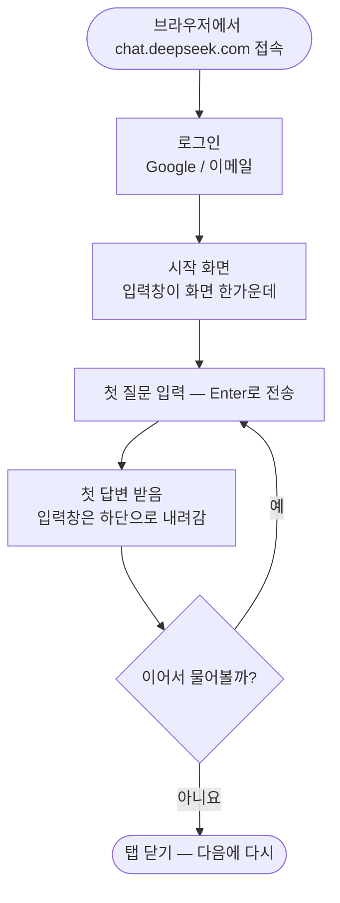

**Flow B. 매일의 핵심 루프 — 질문 ↔ 답변**

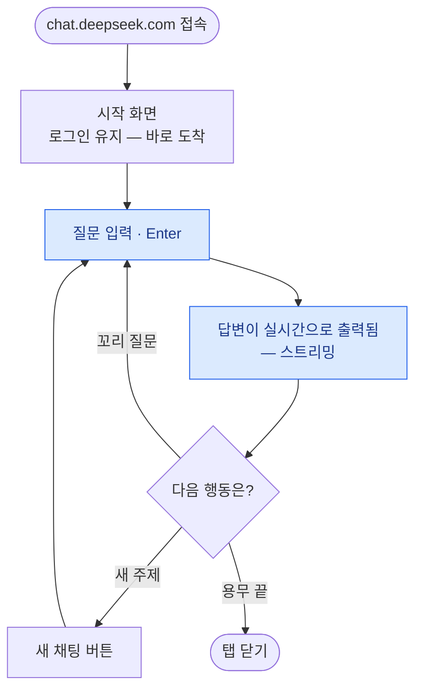

**Flow C. 지난 대화 이어가기 — 클릭 한 번**

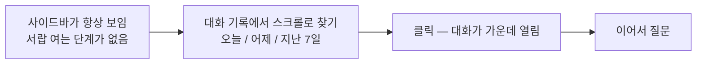

**Flow D. 심층 사고(DeepThink) — DeepSeek만의 흐름**

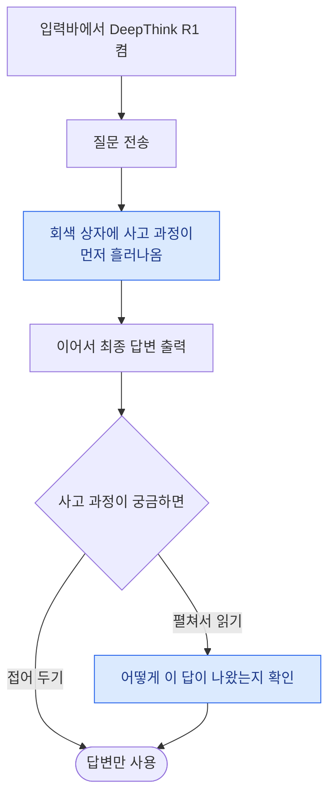

### 모바일 — 폰으로 볼 때

**Flow A. 처음 쓰는 사람 — 설치부터 첫 답변까지**

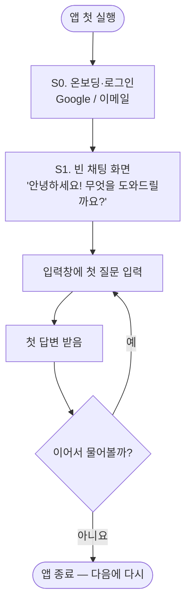

**Flow B. 매일의 핵심 루프 — 질문 ↔ 답변**

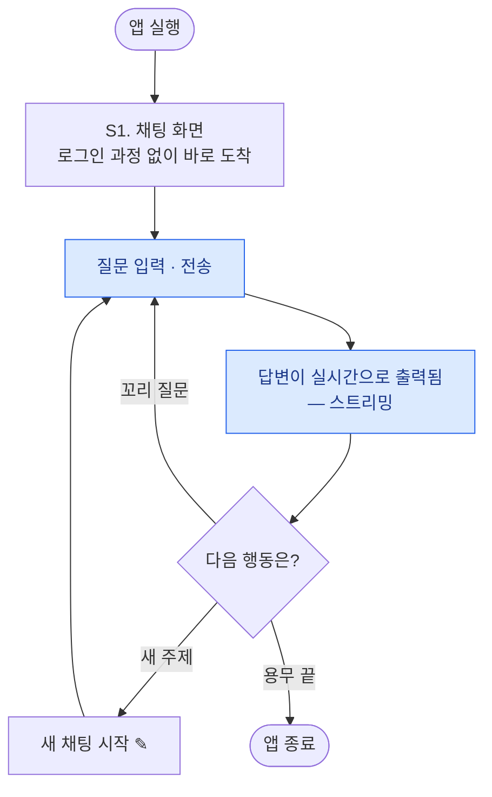

**Flow C. 지난 대화 이어가기 — 서랍을 열고 찾기**

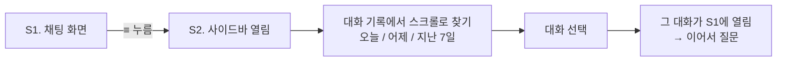

---

## 3. Wireframe — 화면 뼈대

그림 속 파란 번호(①②③…)와 설명이 짝을 이룹니다.

### 데스크톱 — 컴퓨터로 볼 때

<p align="center">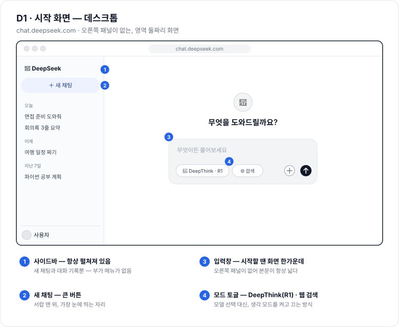</p>

<p align="center">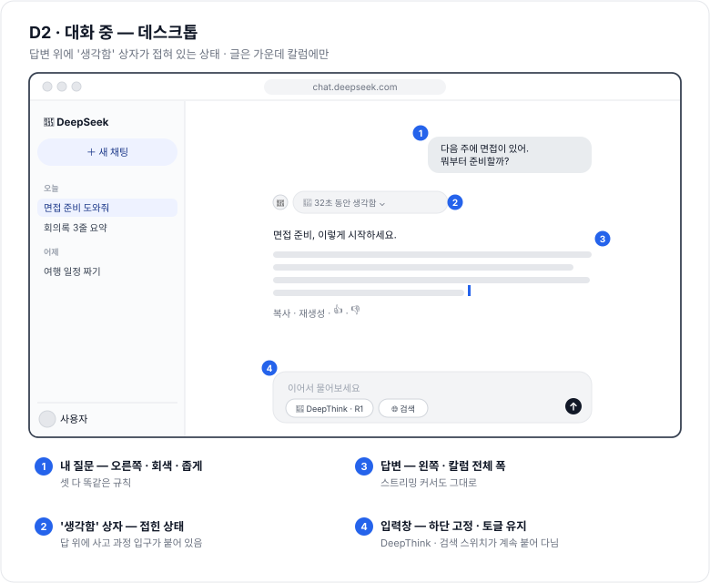</p>

<p align="center">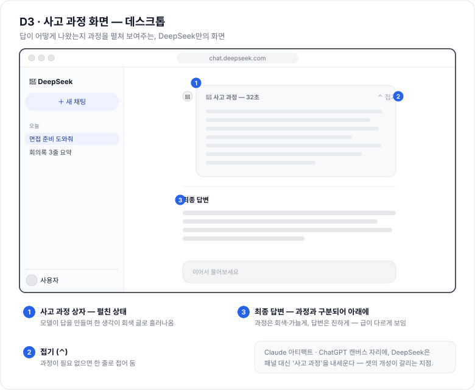</p>

### 모바일 — 폰으로 볼 때

<p align="center">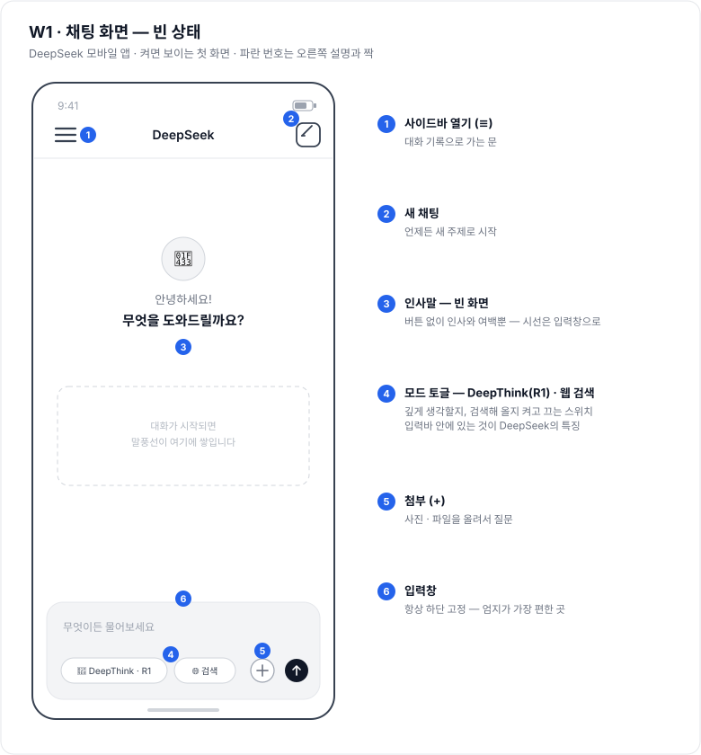</p>

<p align="center">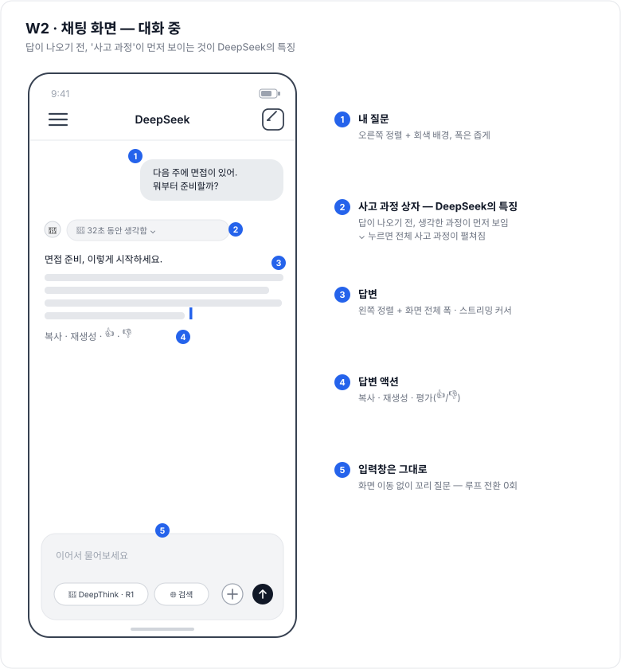</p>

<p align="center">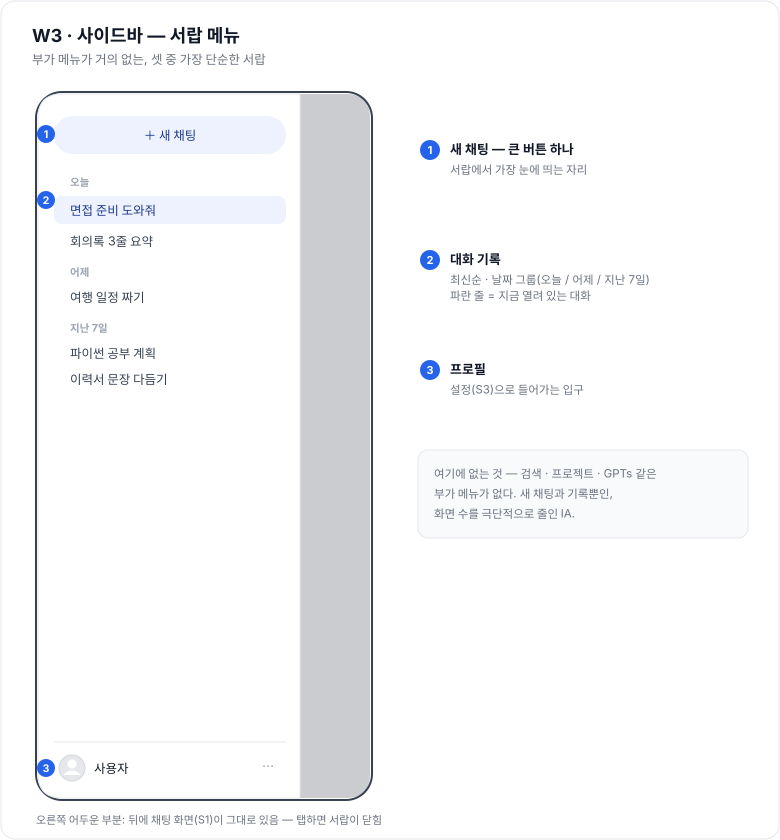</p>

<p align="center">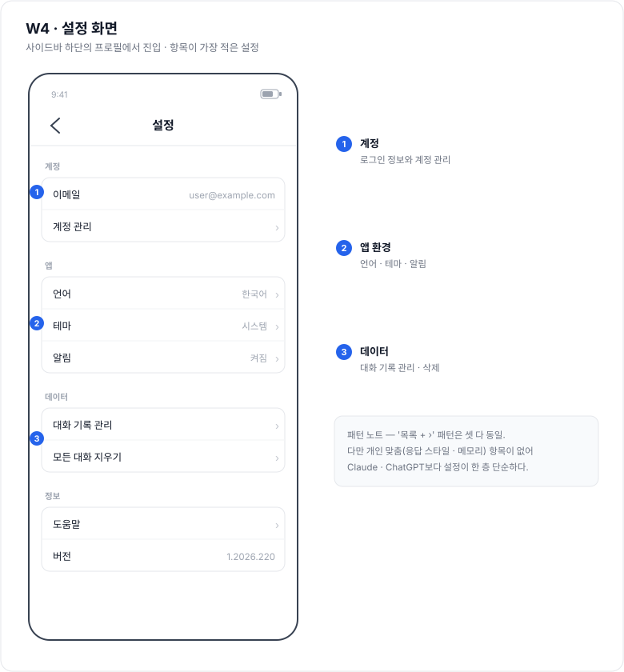</p>

---

화면·기능은 2026년 8월 DeepSeek(데스크톱·모바일) 기준이며, 업데이트에 따라 세부 모습은 조금씩 달라질 수 있습니다.
